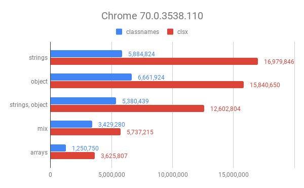
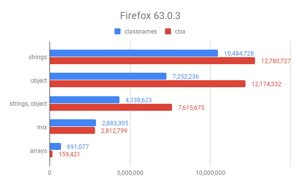
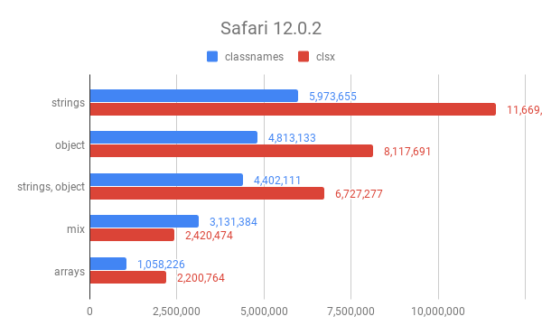

## Benchmarks

> Below you will find benchmark results for [Node.js](#Node) and [multiple browser](#Browsers) engines.

## Node

These are the results while running this directory's benchmark suite in Node v20.10.0.

> **Note:** The `≠` denotes that the candidate has a different API and is not compatible with `classnames` usage.

```
# Strings
  classcat ≠   x  9,613,381 ops/sec ±0.16% (94 runs sampled)
  classnames   x  6,540,072 ops/sec ±0.11% (101 runs sampled)
  clsx         x 12,924,662 ops/sec ±0.15% (102 runs sampled)

# Objects
  classcat ≠   x 8,936,903 ops/sec ±0.12% (100 runs sampled)
  classnames   x 6,143,319 ops/sec ±0.14% (100 runs sampled)
  clsx         x 9,444,110 ops/sec ±0.11% (102 runs sampled)

# Arrays
  classcat ≠   x 8,247,121 ops/sec ±0.12% (98 runs sampled)
  classnames   x 3,451,489 ops/sec ±0.18% (99 runs sampled)
  clsx         x 9,401,030 ops/sec ±0.18% (101 runs sampled)

# Nested Arrays
  classcat ≠   x 6,759,204 ops/sec ±0.31% (97 runs sampled)
  classnames   x 2,015,566 ops/sec ±0.18% (100 runs sampled)
  clsx         x 7,315,032 ops/sec ±0.43% (99 runs sampled)

# Nested Arrays w/ Objects
  classcat ≠   x 6,726,315 ops/sec ±0.16% (98 runs sampled)
  classnames   x 3,059,235 ops/sec ±0.45% (99 runs sampled)
  clsx         x 7,352,761 ops/sec ±0.44% (98 runs sampled)

# Mixed
  classcat ≠   x 6,956,920 ops/sec ±0.21% (97 runs sampled)
  classnames   x 4,171,381 ops/sec ±0.15% (98 runs sampled)
  clsx         x 8,468,116 ops/sec ±0.11% (96 runs sampled)

# Mixed (Bad Data)
  classcat ≠   x 2,128,702 ops/sec ±0.13% (101 runs sampled)
  classnames   x 1,925,670 ops/sec ±0.19% (100 runs sampled)
  clsx         x 2,996,516 ops/sec ±0.07% (100 runs sampled)
```

## Browsers

Results are taken from the [benchmark suite](https://github.com/JedWatson/classnames/tree/master/benchmarks) within the `classnames` repository.

These were run in a clean environment and on 4GHz i7 with 32GB of RAM. As you can see, results _will_ vary from browser to browser – multiple results were included for quick viewing.

---

<p align="center">
  
  
  
</p>
